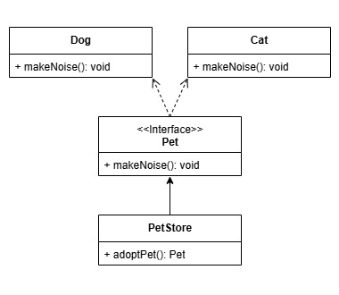

<html>
  <body>
    <h3>
      Scenario
    </h3>
    <blockquote>
      There's a pet store that sells pets. The pet store is responsible for handing out a specified type of pet (either a cat or a dog).
      In this example, the pet store is the factory; the cats and dogs being the products.
    </blockquote>
    <h3>
      Technical Explanation
    </h3>
    <blockquote>
      The factory pattern is creational design pattern. It provides a way of creating objects without specifying the class of the object to be created.
    </blockquote>
    <h3>
      According to the GoF
    </h3>
    <blockquote>
      "Define an interface for creating an object, but let subclasses decide which class to instantiate.
      Factory method lets a class defer instantiation to subclasses."
    </blockquote>
    <h3>
      Components
    </h3>
    <ul>
      <li>Product Interface</li>
      <li>Concrete Products</li>
      <li>Factory</li>
    </ul>
  </body>
</html>

## UML Diagram

Inline-style: 


---

Product Interface - The class interface that the factory is responsible for creating.
```java
interface Pet {

    void makeNoise();
}
```
Concrete Products - The subclasses that are produced by the factory.
```java
class Dog implements Pet {

    @Override
    public void makeNoise() {
        System.out.println("Woof! Woof!");
    }
}

class Cat implements Pet {

    @Override
    public void makeNoise() {
        System.out.println("Meow! Meow!");
    }
}
```
Factory - The class that creates products.
```java
class PetStore {

    public Pet adoptPet(String pet) {
        switch(pet) {
            case "Dog" -> {
                return new Dog();
            }
            case "Cat" -> {
                return new Cat();
            }
            default -> throw new RuntimeException();
        }
    }
}
```
Implementation
```java
public class Factory {

    public static void main(String[] args) {
        var petStore = new PetStore();
        
        Pet pet = petStore.adoptPet("Dog");
        pet.makeNoise();
        
        pet = petStore.adoptPet("Cat");
        pet.makeNoise();
    }
}
```
OUTPUT
```
- Woof! Woof!
- Meow! Meow!
```
